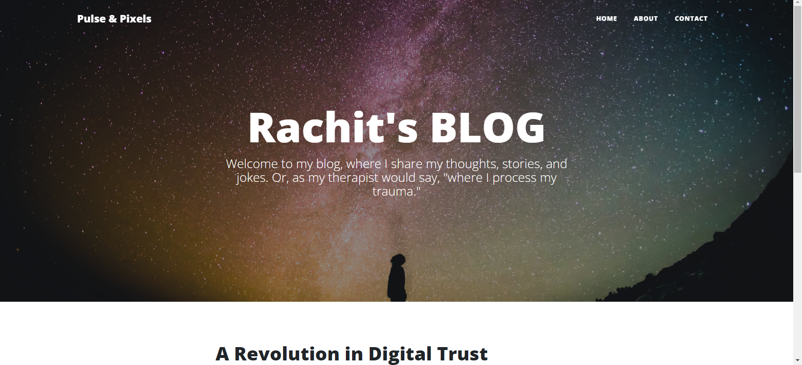
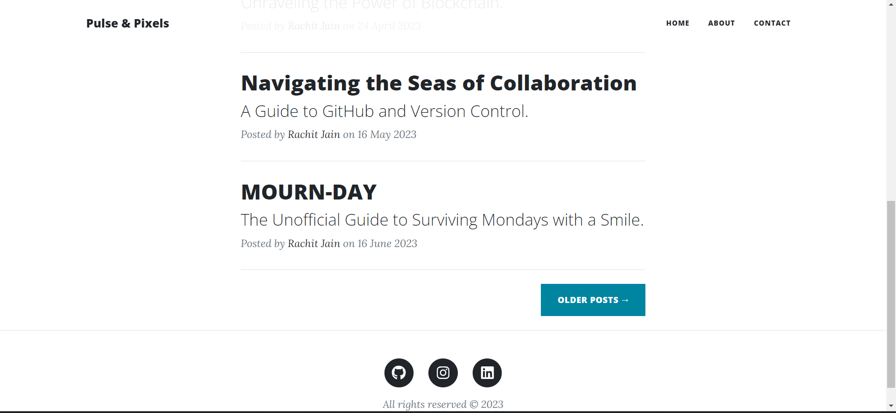
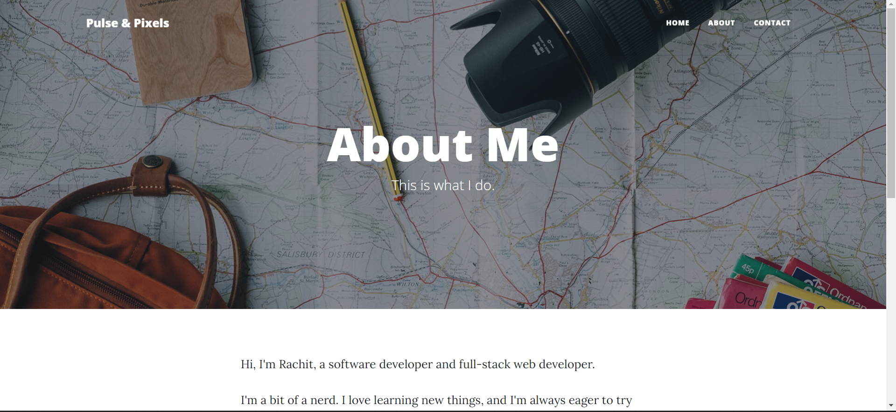
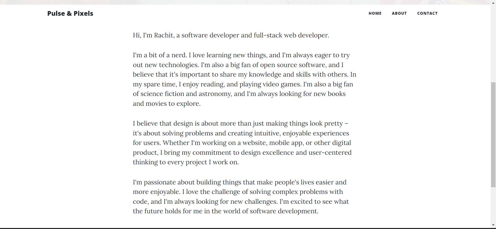
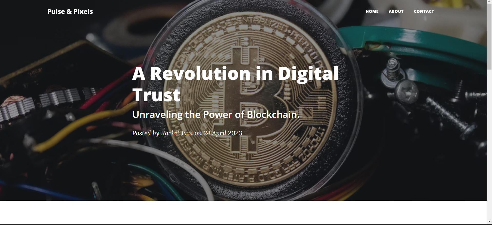
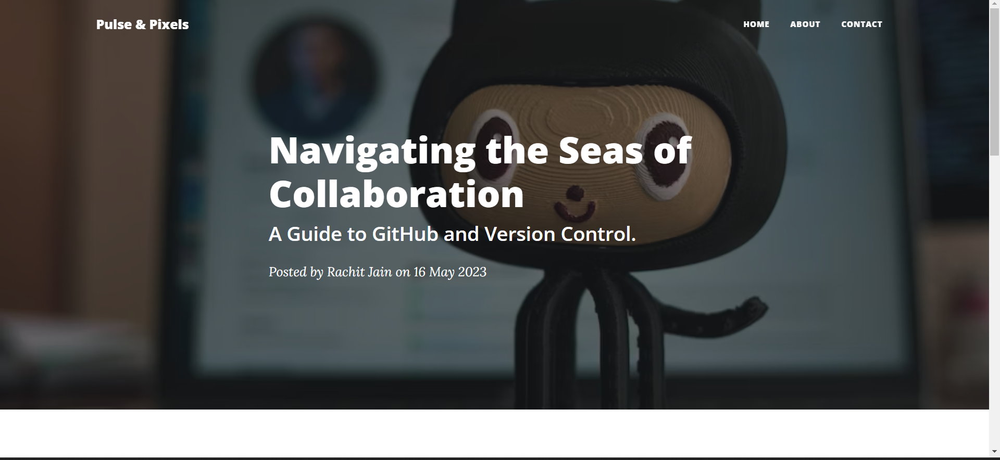
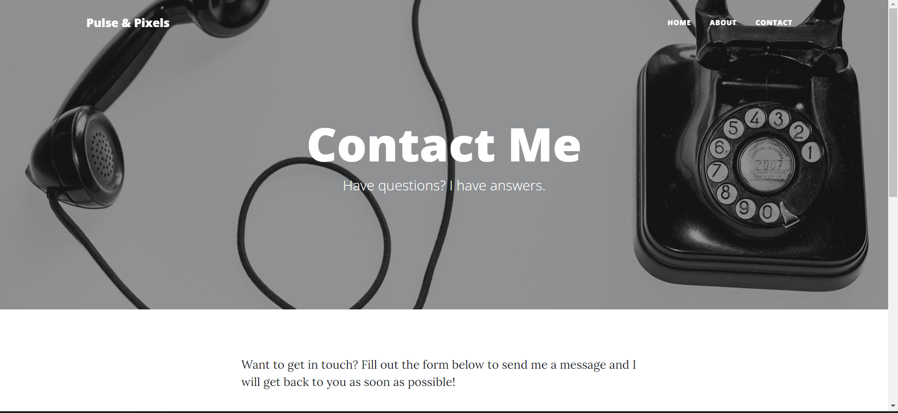
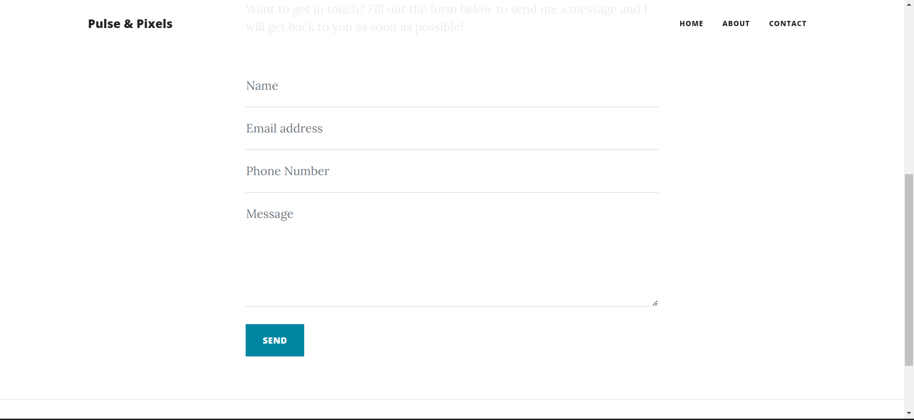

# Blog Website

[//]: # (Blog Website Logo <!-- Replace with your logo -->)

Project Link: "https://pulseandpixels.onrender.com/"

Welcome to the Blog Website project! This web application is designed to showcase blogs, articles, and content in a user-friendly and engaging manner. Built using HTML, CSS, Python Flask, and powered by PostgreSQL, this project seamlessly combines frontend design with backend functionality.

## Project Overview
The Blog Website encompasses the following features to enhance the user experience and interaction:

1. **HTML and CSS Frontend:** The website's frontend is designed using HTML and CSS, ensuring an appealing and intuitive user interface.
1. **Python Flask Backend:** The backend functionality is powered by Python Flask, enabling dynamic content rendering and interaction.
1. **PostgreSQL Database:** The project utilizes a PostgreSQL database for storing and managing blog-related data.
1. **Multi-Page Website:** Enjoy the convenience of a multi-page website structure, providing easy navigation and access to different sections.
1. **Interactive Navigation Bar:** The interactive navigation bar enhances user experience, making it seamless to switch between different pages.
1. **Dynamic Blog Post Pages:** Each blog post is showcased on its dynamically generated page with full-screen titles, capturing attention.
1. **Mobile Responsive:** The website is fully responsive, adapting gracefully to various screen sizes, including mobile devices.
1. **Adaptive Navigation Bar:** The navigation bar adapts to different screen sizes, ensuring usability on all devices.
1. **Jinja Templates:** Utilize Jinja templates for rendering header and footer templates, ensuring consistency across pages.
1. **Contact Form and Email Integration:** The website features a contact section with HTML forms. Flask's GET and POST methods facilitate data submission, and Python's SMTP library sends submitted data to your designated email ID.

## How to Use
To experience the Blog Website:

1. Open the application by navigating to its URL.
1. Explore the interactive navigation bar to access different sections and pages.
1. Read engaging blog posts, with each post presented on its dedicated full-screen page.
1. Interact with the website across different devices to observe its mobile responsiveness.
## Dependencies
The Blog Website project relies on the following key dependencies:

* **HTML and CSS:** The frontend is designed using HTML and CSS for a visually appealing user interface.
* **Python Flask:** Flask powers the backend functionality, enabling dynamic content rendering and interactions.
* **PostgreSQL:** The PostgreSQL database stores and manages blog-related data.
* **Jinja Templates:** Jinja templates are used for rendering consistent header and footer templates across pages.
* **SMTP Library:** Python's SMTP library facilitates the sending of email notifications for data submitted through the contact form.
## Contributing
Contributions to the Blog Website project are welcome! If you identify issues or have ideas for enhancements, feel free to open an issue or submit a pull request.

## Working Images

### Home:

### About:

### Post:

### Contact:

